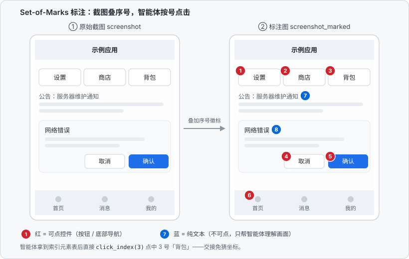
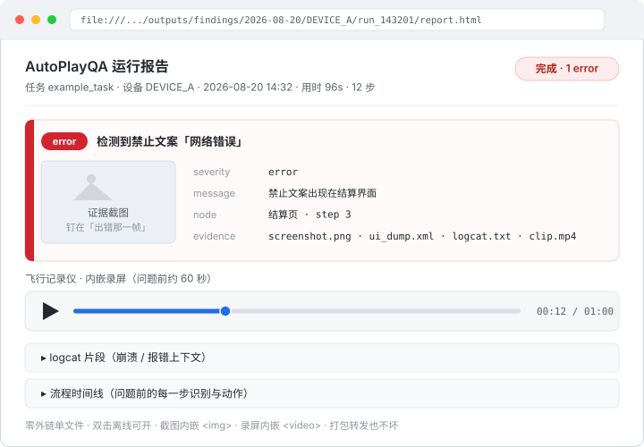
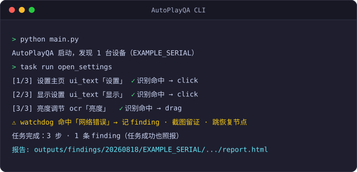
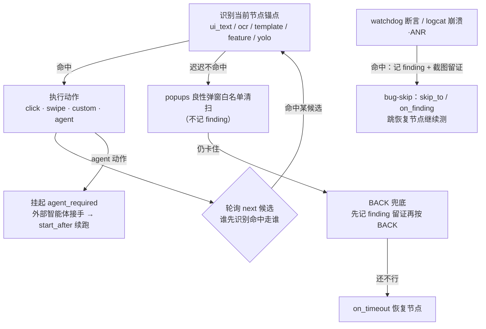
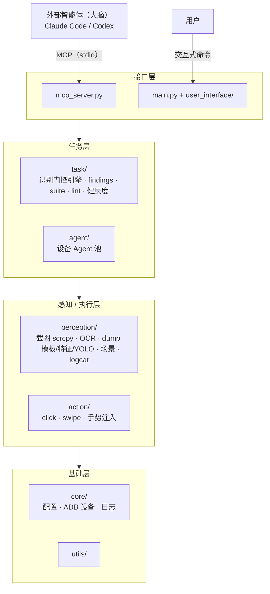

# AutoPlayQA

> **Android 游戏 QA 自动化测试框架**——确定性的「眼睛（感知）+ 手脚（动作）」加识别门控任务引擎。大脑交给外部 AI 智能体（Claude Code / Codex 经 MCP 或 CLI 驱动），项目自身不调用任何大模型，**零 token 成本**。

框架**不绑定任何一款游戏**：场景标签体系、任务 JSON、模板图、YOLO 模型都由接入方（被测游戏所在的项目）提供；本仓库只负责通用部分——感知通道、动作后端、识别门控任务引擎、QA 取证与 MCP / CLI 接口。

    

## 目录

- [功能特性](#功能特性)
- [快速开始](#快速开始)
  - [环境](#环境)
  - [方式一：MCP（推荐）](#方式一mcp推荐claude-code--codex-当大脑)
  - [方式二：本地 CLI](#方式二本地-cli)
- [任务引擎（核心）](#任务引擎核心)
- [创建任务](#创建任务)
- [目录结构](#目录结构)
- [测试](#测试)
- [关于](#关于)

## 功能特性

### 感知与动作（确定性的眼睛和手脚）

- 📱 自动识别接入的 Android 模拟器和真机（ADB）；支持无线 adb：`connect` / `pair`（Android 11+）/ `tcpip` 一键切换，config 列表启动自动连
- 🤖 一设备一 Agent，Agent 池管理多设备
- 👁️ 免费屏幕定位双通道：uiautomator dump 控件匹配 → 本地 OCR（rapidocr，游戏单 Surface 渲染也可用）
- 🧩 OpenCV 模板匹配：认出文字通道看不见的**图形**（游戏建筑 / 图标等纯贴图）——多尺度扫描 + 透明通道掩膜 + 多实例 NMS；`capture_template` 采集 → `find_template` 定位 / 任务用 `template` 识别门控点击
- 🧷 ORB 特征匹配：模板匹配的抗形变兄弟——描述局部关键点而非逐像素相关，扛得住小改版 / 缩放旋转 / 局部遮挡；任务用 `feature` 识别门控。**只适合纹理丰富的锚点**（纯色扁平图标提不出关键点，仍走 `template`）
- 🔎 YOLO 目标检测（可选，onnxruntime 推理、无 PyTorch）：训练过的模型**定位 + 分类**画面里的物件，抗位移·缩放·遮挡（模板匹配的死穴）；**模型由接入方训练并提供**——把 `.onnx` 放进 `task/models/` 即启用，`detect_objects` 检测 / 任务用 `yolo` 识别门控，无模型时自动惰性让位；模型版本记在 `task/models/models.json`（文件名 → `version` / `date` / `notes` / `classes` / `training_ref`），`list_yolo_classes` 顺带把版本报给智能体
- 🧭 场景分类（scene）：整屏回答"我现在在哪个界面"，用于跑飞后确认位置与异常分支断言（不返回坐标，不做锚点定位）。**框架只内置一个标签 `blank`**（近黑 / 息屏 / 空帧），外加非场景信号 `other_app` 与永不猜的 `unknown`；其余标签由接入方用 `register_scene_probe(label, fn, *, description=..., order=...)` 注册（另有 `unregister_scene_probe` / `clear_scene_probes` / `registered_scene_probes`）。`expected` 按**点号前缀匹配**（`"popup"` 命中 `popup.error`，`"menu"` 命中 `menu.settings`）；MCP `classify_scene` 返回当前生效的 `taxonomy`
- 🏷️ Set-of-Marks 标注图：截图叠加序号徽标（红=可点控件 蓝=纯文本），智能体按编号点击（`click_index`）免猜坐标
- 🎯 点击 / 拖拽 / 文本输入 / 按键 / 等待
- ✋ **无 root 多指手势**：`app_process` 拉起轻量 dex helper 走系统隐藏 `injectInputEvent`（与 `input` 同特权路径），免 root、免写 `/dev/input`（现代 MIUI / HyperOS 对 shell 域已 SELinux 封禁）即可注入多指 MotionEvent；`gesture` 动作收 `frames` 帧序列或 `pinch` 便捷参数，解决双指缩放 / 旋转 / 双指拖拽等动态手势瓶颈（dex 不入库，按 `injector/build.ps1` 从可审源码自建）

<p align="center"></p>

*Set-of-Marks 标注图示意（合成界面，非真实游戏截图）：`screenshot_marked` 给可点控件打红色序号、纯文本打蓝色序号并返回索引元素表，智能体接手时 `click_index(N)` 按号点击，不必猜坐标。*

### 任务引擎（确定性重放）

- 🔁 识别门控任务引擎：任务 JSON 状态机（识别确认到达预期界面才执行动作），支持分支、超时恢复、断点续跑——一次操作，零 token 重放
- 🧩 任务可组合：`includes` 共享节点文件（通用弹窗处理写一份处处引用）+ `custom` 进程内确定性动作（内置 `swipe_until` 滑动找目标、`launch_app` 冷启动、`gm_command` 下发 GM 指令等）
- 🗂️ 回放锚点缓存：OCR 先查缓存 ROI 再回退全屏加速；锚点移位上报 `anchor_drift` finding 而非静默自愈
- ⏭️ **上报后跳过（bug-skip）**：检测到 bug（watchdog 命中 / logcat 崩溃·ANR）可上报留证后跳到恢复节点继续测，不必中止；纯卡顿 / 超时绝不触发跳转（那是 `on_timeout` 的活）——只有上报的 bug、而非卡慢才改道流程
- 🧹 **良性弹窗白名单**：任务 `popups` 字段显式列出已知良性弹窗（用户协议 / 游戏内告警等预期噪音），识别卡住时自动消除且**不记 finding**；未列入的弹窗仍照常卡成超时 / watchdog 发现——区分"噪音"与"异常"，不静默吞 bug
- 🔙 **BACK 兜底**：白名单扫尽仍卡住（未知弹窗盖屏）时，先把 finding 钉在那一帧留证，再按一次 BACK 并用像素差分确认真的动了才多给一轮识别；节点自带 `on_timeout` 时让位给作者写的恢复分支，且**永不跳转**（跳转是 bug-skip 的活）
- 🩺 **锚点健康度**：每轮统计节点命中来源（直接命中 / 超时恢复 / 弹窗协助 / BACK 兜底 / 漂移）出 `node_stats`，反复靠兜底才过的节点记 `anchor_rot_suspect`（任务锚点腐烂，不是游戏 bug）；CLI `task health` 跨 run 聚合看趋势，`task lint` 保存前体检易碎写法（W001-W007）
- 🔗 **套件连跑（suite）**：多个用例编进一份 suite JSON（`cases` + 必填的 `resume_after`/`case_entry`/`landing`，无框架默认值），共享一次冷启动+登录连续跑，每个用例仍是独立 run、独立 findings 目录；用例失败按 `on_case_failure` 重启重试 / 跳过 / 中止

### QA 取证（异常即测试发现）

- 🔬 **三类触发**（findings 始终记录，不依赖 debug 开关）：任务级 `watchdogs` 负向断言（禁止文字 / 白屏不该出现）、节点 `finding` 字段（弹窗·报错分支自我上报）、logcat `crash`·`ANR` 监控——命中即记一条发现
- 🛫 **触发即留证**：当场截图（出错那一帧）+ 失败附 `ui_dump`，并带「飞行记录仪」黑匣子——问题前 ~60s 的上下文：logcat 片段 · 流程时间线 · 设备端滚动录屏（真 MP4）
- 📦 **结果交付**：运行结果带 `findings`（任务成功也照列），整夹证据可导出（截图 + 日志 + 录屏 + `report.json`，自包含相对路径）
- 📄 **人读报告**：同一份数据顺手渲染 `report.html`——零外链单文件，双击离线可开、打包邮件转发也不坏，截图内嵌 ``、录屏内嵌 `<video>`、logcat 与流程时间线折叠展开，交给不看 JSON 的 QA 同事
- 🧾 **证据保留**：`outputs/findings/<日期>/<设备>/<run_id>/` 自包含可浏览，启动按 `findings.retention_days`（默认 14 天）清理过期日期目录；配 `findings.export_dir` 后有 finding 的运行自动打成单个 zip（`时间戳_任务_设备_状态.zip`）
- 🛰️ **空窗期哨兵**：任务跑完 / `agent` 交接期间，引擎那一轮的 run 已封口，屏幕和 logcat 本来无人看管——后台帧监控挂一个哨兵，**白吃已有的帧**（不加截图、不加 adb 来回）继续查白屏卡死（连续 N 帧灰度 stddev 低于阈值算一次 episode，只报一次、恢复后重新武装）与 crash / ANR，命中就写成一次普通的 findings run（任务名 `monitor_sentinel`），证据补一张无损原图。按设备门控：引擎在跑 A 机时 B 机的哨兵照看不误
- 📣 **结果推送**：无人值守跑完不必等人去翻目录——配 `findings.notifiers`（飞书自定义机器人 / 通用 webhook）后，每个 run 收尾推**一条**中文汇总（任务 / 设备 / 状态 / 各级别计数 / 前 3 条 finding / 报告与证据包路径）；`min_findings`、`on_status` 过滤，干净跑完默认不吵人，推送失败只记日志、绝不影响运行结果

<p align="center"></p>

*离线报告 `report.html` 结构示意（合成界面，非真实游戏截图）：一条 finding = 出错那一帧的证据截图 + 字段 + 内嵌录屏 + 可折叠的 logcat 片段与流程时间线；零外链单文件，双击离线可开、转发不坏。*

### 性能与接入

- ⚡ scrcpy 帧流截图后端（**默认**）：常驻 H.264 流本地解码 ~13ms/帧，screencap 兜底（任何失败自动回退、反复失败 latch off）；需精确像素或 scrcpy 不可用时设 `capture.backend: screencap`
- 🔌 MCP 服务器：Claude Code / Codex 即插即用
- 📝 多种任务创建方式：手写 JSON / 智能体真机探路生成 / 观察式录制（用户手动演示，智能体监控生成）/ CLI 会话录制草稿

## 快速开始

### 环境

```powershell
# Python 3.11 环境（conda / venv 均可）
conda create -n autoplayqa python=3.11 -y
conda activate autoplayqa
pip install -r requirements.txt

# adb 需在 PATH（Android SDK platform-tools 默认安装位置）
$env:PATH = "$env:LOCALAPPDATA\Android\Sdk\platform-tools;$env:PATH"
```

### 方式一：MCP（推荐，Claude Code / Codex 当大脑）

复制 `.mcp.json.example` 为 `.mcp.json`，把 `command` 改成你环境的 Python 解释器绝对路径；之后在本项目目录启动 Claude Code 即自动发现 `autoplayqa` 服务器。

Codex CLI 在 `~/.codex/config.toml` 添加（路径按本机调整）：

```toml
[mcp_servers.autoplayqa]
command = "C:\\path\\to\\python.exe"
args = ["C:\\path\\to\\autoplayqa\\mcp_server.py"]
```

然后直接对智能体说："连接设备，打开设置把亮度调到 50%，完成后存成任务"。

**MCP 工具清单**

| 类别 | 工具 |
|------|------|
| 设备 | `list_devices`、`connect_device` / `disconnect_device` / `enable_wireless` / `pair_device`（无线 adb） |
| 感知 | `screenshot`（返回 PNG 路径可直接查看）、`screenshot_marked`（Set-of-Marks 标注图，配合 `click_index` 按号点击）——两者返回图默认短边归一化 720p 省 token，`full_resolution=true` 拿原图（识别与元素表坐标始终用设备原始像素）、`ui_dump`、`find_text`（dump→OCR 免费定位）、`ocr`、`find_template`（OpenCV 模板匹配定位图标/贴图）/ `capture_template`（裁屏存模板）/ `list_templates`、`detect_objects`（YOLO 检测+分类）/ `list_yolo_classes`、`classify_scene`（整屏场景判定，返回当前 `taxonomy`——标签由接入方注册） |
| 动作 | `click` / `click_index`（点上次 `screenshot_marked` 的第 N 号元素）、`swipe`、`input_text`、`press_key` |
| 录制 | `calibrate_touch`（触摸面板→显示像素标定）、`record_gestures_start` / `record_gestures_stop`（getevent 真手指手势录制，产物落 `outputs/recordings/<时间戳>/`）、`record_actions_start` / `record_actions_stop`（智能体动作日志：自主探索自录 / agent 交接归档） |
| 监控 | `start_monitor` / `get_new_frames` / `stop_monitor`（后台按间隔持续取帧落盘，智能体按游标增量拉路径自己挑帧读；`sentinel=true` 默认挂哨兵，三个工具返回值都带 `sentinel` 统计，`stop_monitor` 附哨兵那一轮的报告路径） |
| 任务 | `get_task_schema`、`list_tasks`、`get_task`（附 `_steps` / `_step_outline` 步号导航）、`save_task`（返回 `lint_warnings`）、`run_task`（同步阻塞，跑完返回；`export_to` 按次导出 findings）、`start_task` / `get_run_status`（后台跑长任务 + 轮询进度）、`list_suites` / `run_suite`（套件连跑：登录一次连跑多用例，后台跑，同样用 `get_run_status` 轮询，含 case 进度）、`validate_task` / `lint_saved_task`（不落盘校验 / 对已存任务体检）、`get_step_labels` / `list_includes` / `list_custom_actions`（步号映射 / 共享节点片段 / 已注册 custom 动作）、`clear_replay_cache` |

### 方式二：本地 CLI

```powershell
python main.py       # 交互式 CLI（确保 adb 已在 PATH）
```

<p align="center"></p>

*交互式 CLI 会话一瞥（**输出为示意**，非实录）。*

| 命令 | 说明 |
|------|------|
| `device list` / `agent list` / `agent select <i\|id\|all>` | 设备与 Agent 管理 |
| `device connect <ip[:port]>` / `device disconnect [addr]` / `device tcpip <id>` / `device pair <addr> <code>` | 无线 adb 连接 |
| `click <x> <y>` / `drag <x1> <y1> <x2> <y2> [ms]` / `input <text>` | 直接动作 |
| `action "<指令>"` 或直接输入自然语言 | 本地解析：显式坐标正则 → dump/OCR 文本定位（如"点击设置按钮"） |
| `task list` / `task show <name>` / `task run <name>` | 任务管理与运行（`show` 先打印按步号排序的流程大纲再打印原文） |
| `task suites` / `task suite <name> [device]` | 套件连跑：登录一次连跑多用例，跑挂按策略重启重试 |
| `task resume <name> <node>` | agent 交接步骤完成后续跑 |
| `task renumber <name>` | 按当前图重算步号并写回文件 |
| `task lint <name>` | 任务加固体检（W001-W007，只提醒不阻断） |
| `task health [name] [--days N]` | 跨 run 聚合 `node_stats`，看锚点腐烂趋势 |
| `task handoffs [name] [--days N]` | 聚合 agent 交接动作日志，提示哪些交接节点可固化为确定性节点 |
| `task cache status` / `task cache clear` | 回放锚点缓存查看 / 清空 |
| `record on/off/status` + `task save <name>` | 录制会话 → 回放草稿任务 |
| `record gestures start/stop/status [device]` | getevent 真手指手势录制（多指 / 长按 / 滑动分段 + 触摸校准） |
| `debug on/off` | 调试落盘（截图标注、识别候选、trace） |

## 任务引擎（核心）

任务是识别门控状态机（`task/task_definitions/*.json`）：每个节点先**识别**（`ui_text` 控件匹配 / `ocr` / `template` 图标匹配 / `feature` ORB 特征 / `yolo` 目标检测 / `scene` 整屏场景 / `blank_screen` / `always`）确认界面，命中才执行动作，再轮询 `next` 候选列表跳转——谁先识别命中走谁（天然支持弹窗分支）；超时走 `on_timeout` 恢复节点。



```json
{
  "entry": "点击设置",
  "nodes": {
    "点击设置": {
      "step": "1",
      "recognition": {"type": "ui_text", "expected": "设置"},
      "action": {"type": "click", "target": "recognized"},
      "next": ["进入显示设置"]
    },
    "进入显示设置": {
      "step": "2",
      "recognition": {"type": "ui_text", "expected": "显示"},
      "action": {"type": "click", "target": "recognized"},
      "next": [],
      "on_timeout": "点击设置"
    }
  }
}
```

需要智能判断的步骤用 `agent` 动作：引擎挂起并返回 `status=agent_required` + 指令文本，智能体用设备工具完成该步后 `run_task(start_after=<节点>)` 续跑。完整格式见 `get_task_schema` 或 `action/action_schema.py`，交接一来一回的时序图见 [docs/MCP_INTEGRATION.md](docs/MCP_INTEGRATION.md#agent-交接识别到人类判断步骤怎么办)。

**步号（step）**：节点可带一个**只供阅读**的 `step` 步号标识执行顺序——主干（从 `entry` 沿 `next[0]` 走）是整数 `1, 2, 3…`，兜底分支（`on_timeout` / `next[1:]`）挂点号如 `2.1`、`2.1.1`，不可达节点为 `?`。任务是图不是列表，光顺着 JSON 从上往下读看不出执行顺序，步号让人/智能体一眼定位某节点在流程里的位置。**引擎不读它**，纯导航用。步号从图实时算出：CLI `task renumber <name>` 按当前图重算并把 `step` 写回文件（置于节点首位），`task show <name>` 先打印按步号排序的流程大纲再打印原文；MCP `get_task` 额外返回 `_steps`（名→步号映射）+ `_step_outline`（流程清单）。编辑任务后重跑 renumber 即刷新，不会留下错位的旧号。

**后台执行（长任务）**：`run_task` 同步阻塞、跑完才返回、中途无进度，长任务/全流程冒烟体验差。改用 `start_task` 立即拿到 `run_id`，再 `get_run_status(run_id)` 轮询：返回 `status`（running / agent_required / done / error）+ `current_node` + `steps` + `elapsed_s`，终态附与 `run_task` 同构的完整结果（`steps` / `findings` / `report` / `handoff`）。引擎是单例，同一时刻只允许一个后台 run；`agent_required` 时按 `result.handoff` 完成该步后 `start_task(start_after=<节点>)` 续跑。

**套件连跑（suite）**：多个用例共享一次冷启动 + 登录连续跑（`task/task_definitions/suites/*.json`；MCP `list_suites` / `run_suite`，CLI `task suites` / `task suite <name>`）。suite JSON 声明 `cases` 列表 + `resume_after`（跳过开场直接续跑的节点）/ `case_entry`（用例正文入口）/ `landing`（两用例之间校验落地画面的识别 spec）**三字段必填、无框架默认值**，`validate_suite` 跑前校验，缺字段直接报错。首个用例整段冷启动，后续用例靠 `resume_after` 跳过重复登录，但每个用例仍是独立 run（独立 findings 目录 / `report.json`）；用例失败（跑挂 / 崩溃 / 落地画面对不上）按 `on_case_failure` 处理：`restart_retry`（默认，冷启动重跑重试）/ `restart_continue`（不重试，下一用例照常冷启动）/ `abort`（终止套件，剩余用例标记跳过）。

```json
{
  "name": "smoke_mini",
  "cases": ["chat_smoke", "main_smoke"],
  "resume_after": "主场景确认",
  "case_entry": "用例开始",
  "landing": {"type": "ocr", "expected": "主界面", "roi": [0, 2280, 1080, 2448]}
}
```

**共享节点（includes）**：通用弹窗处理等共享节点放 `task/task_definitions/common/*.json`（仅含 `"nodes"`，单层引用），任务里用 `"includes": ["common/popups.json"]` 引入。跨文件 `next`/`on_timeout` 引用在合并后的节点表上整体校验，全部通过才运行（原子加载）。重名节点默认报错（strict），设 `"on_conflict": "overwrite"` 后加载者覆盖——主文件最后合并，因此任务可特化共享节点。任务保存时保留引用，include 文件更新对引用它的任务下次运行即生效。

**确定性复杂步骤（custom）**：介于单条 adb 原子动作和 agent 挂起之间的多步确定性逻辑（无需智能判断），写成 Python handler 用 `@register("名字")` 注册进 `task/custom_actions/`，任务里用 `{"type": "custom", "name": "swipe_until", "params": {...}}` 引用，加载时校验已注册。内置：`swipe_until`（反复滑动直到识别命中，列表 / 滚动页找目标）、`launch_app`（唤醒亮屏 + 拉起应用，冷启动开场）、`gm_command`（GM 面板下发指令，自动处理输入法）、`ensure_checkbox`（把开关拨到目标态）、`set_text_field`（清空后输入）。新建 `task/custom_actions/<模块>.py` 会被包内自动发现并注册（`pkgutil` 按名扫描 import），无需手改 `__init__.py` 接线；模块 import 失败会直接抛错（fail-fast），不会静默变成运行时"未注册"。

**上报后跳过（bug-skip）**：检测到并上报 bug 后，可不中止而跳到指定恢复节点继续测。两层标注——watchdog 的 `skip_to`（命中即跳，优先级最高，压过 `fail_task`）+ 任务级 `on_finding`（全局兜底目标，也覆盖 logcat 崩溃 / ANR 这类无 watchdog 的 bug）。关键约束：**只有"新记下一条 finding"才跳**（同一 watchdog 每轮最多跳一次，靠 seen 集合去重），且**触发源仅 watchdog 命中 + logcat 崩溃 / ANR**——纯识别超时（卡顿，无 bug）绝不跳，仍走 `on_timeout`。加载时校验 `skip_to` / `on_finding` 引用的节点存在。

落到一个任务里长这样（上面的核心例子是纯流程，没出现过这些字段——任务级 `watchdogs` / `on_finding`、节点级 `finding`）：

```json
{
  "entry": "开始战斗",
  "on_finding": "回到主界面",
  "watchdogs": [
    {"type": "ocr", "expected": "网络错误", "skip_to": "回到主界面", "message": "战斗中弹出网络错误"},
    {"type": "blank_screen", "fail_task": true, "message": "黑屏卡死"}
  ],
  "nodes": {
    "开始战斗": {
      "recognition": {"type": "ui_text", "expected": "开始"},
      "action": {"type": "click", "target": "recognized"},
      "next": ["结算页", "战斗失败弹窗"]
    },
    "结算页": {
      "recognition": {"type": "ocr", "expected": "胜利"},
      "action": {"type": "none"},
      "next": []
    },
    "战斗失败弹窗": {
      "recognition": {"type": "ocr", "expected": "战斗失败"},
      "finding": {"severity": "warning", "message": "战斗失败弹窗（异常分支，自我上报）"},
      "action": {"type": "click", "target": "recognized"},
      "next": ["回到主界面"]
    },
    "回到主界面": {
      "recognition": {"type": "ui_text", "expected": "主界面"},
      "action": {"type": "none"},
      "next": []
    }
  }
}
```

- `watchdogs[0].skip_to`：战斗中 OCR 到「网络错误」→ 记 finding 后跳 `回到主界面` 继续测；
- `watchdogs[1].fail_task`：黑屏 → 直接判任务失败（没给 `skip_to` 兜它）；
- 任务级 `on_finding`：logcat 崩溃 / ANR 这类没有对应 watchdog 的 bug，统一兜到 `回到主界面`；
- 节点 `战斗失败弹窗.finding`：异常分支一进去就自我上报，不依赖 watchdog。

**良性弹窗白名单（popups）**：任务 `popups` 字段显式列出已知良性弹窗（用户协议、游戏内告警等预期噪音）及其识别 + 消除动作（仅 `click` / `key` / `gesture`）。**仅在识别卡住时**才扫一遍并消除、**不记 finding**（截图是性能瓶颈，故不增加每步开销）；未列入白名单的弹窗仍会卡成超时 / watchdog 发现——区别于 fork 的静默吞弹窗，本项目坚持"异常即发现、别静默自愈"。被消除的弹窗名在 `result["popups_dismissed"]` 返回。

**未知弹窗 BACK 兜底（back_fallback）**：白名单扫尽仍卡住，说明盖屏的是**没预料到**的东西。引擎先把 `unknown_popup_backoff` finding 钉在当前那一帧（先留证——BACK 可能把现场抹掉），再按一次 BACK，并用像素差分确认屏幕确实变了才多给一轮识别。它**只解卡、不跳转**（跳转是 bug-skip 的活）；节点自带 `on_timeout` 时完全让位给作者写的恢复分支，因此只兜那些原本必然跑挂的死路。config `engine.back_fallback` 默认开，任务 JSON 里 `"back_fallback": false` 可单独关。

**锚点健康度（node_stats / task health / task lint）**：引擎按节点统计命中来源——直接命中、超时恢复、弹窗协助、BACK 兜底、锚点漂移——出 `result["node_stats"]` 并写进 `report.json`。一轮内反复靠兜底才过、或锚点连续移位的节点记一条 `anchor_rot_suspect` 警告 finding：**这是任务锚点腐烂，不是游戏 bug**（阈值 `engine.rot_suspect_timeouts` / `engine.drift_tolerance_px`）。CLI `task health [name] [--days N]` 离线聚合历史 run 的 `node_stats` 看趋势；`task lint <name>`（保存时 `save_task` 也自动跑）体检"合法但易碎"的写法——无恢复分支的死节点、看着像报错却不上报的分支、冷启动任务没配弹窗白名单、有锚点却写死坐标、整个任务零 QA 断言，默认只提醒，config `lint.strict: true` 可改成拒绝保存。

## 创建任务

四种方式，按推荐程度排序：

| 方式 | 怎么做 | 适用场景 |
| ------ | -------- | ---------- |
| **观察式录制（推荐）** | 对智能体说"我手动走一遍你来录"，然后在手机上演示流程；智能体经 MCP 同步截图/识别每一步，直接产出真机验证过锚点的识别驱动任务。完整流程（含 getevent 精确触摸捕获、换设备校准）见 `.claude/skills/live-record/SKILL.md` | 会操作但说不清步骤；流程长 |
| **智能体探路生成** | 描述目标（如"打开设置把亮度调到 50%，存成任务"），智能体用 `screenshot`/`ui_dump`/`find_text` 逐步确认锚点并执行，再 `save_task` 保存、`run_task` 验证。通道选择 / QA 断言 / 回放迭代见 `.claude/skills/author-task/SKILL.md` | 能用语言说清目标 |
| **手写 JSON** | 照 `get_task_schema`（或 `action/action_schema.py`）的格式直接写 `task/task_definitions/*.json`；通道怎么选、该加哪些 QA 断言见 `.claude/skills/author-task/SKILL.md` | 熟悉格式、流程简单 |
| **CLI 录制草稿** | CLI 里 `record on` → 敲指令操作 → `record off` → `task save <name>`，生成盲回放草稿（`always` 识别 + 字面动作），再交给智能体改写为识别驱动版本 | 离线快速记骨架 |

无论哪种方式，写任务遵循同一约定：识别锚点优先 `ui_text`（系统界面）/ `ocr`（游戏单 Surface 文字）/ `template`（图标·贴图等无文字元素）/ `feature`（纹理丰富、会小改版的锚点）/ `yolo`（训练后的目标检测，抗形变遮挡）/ `scene`（只回答"我在哪"，不产坐标），动作用 `"target": "recognized"` 不写死坐标；弹窗等异常分支节点加 `finding` 字段，任务级加 `watchdogs` 负向断言——本项目定位是 QA 测试工具，异常要上报留证而不是静默绕过。

## 目录结构



*依赖只能自上而下：感知 / 执行层不得 import 任务层，基础层不得 import 上层。项目自身零 LLM 调用——智能永远在外部智能体那一侧。*

```
autoplayqa/
├── mcp_server.py                 # MCP 入口（FastMCP / stdio）：感知/动作/任务工具全集，装配复用 bootstrap.py
├── main.py                       # CLI 入口：config → 设备 → 感知 → 解析 → 任务引擎 → Agent 池 → CLI，装配复用 bootstrap.py
├── bootstrap.py                  # 双入口共用装配层：load_app（读配置建日志）+ build_runtime（拼感知/任务对象图）
├── .mcp.json.example             # Claude Code 自动发现配置模板（复制为 .mcp.json 改 Python 路径）
├── config.yaml.example           # 配置模板（缺省走默认值，无需任何凭证即可启动）
├── requirements.txt              # 依赖
│
├── core/                         # 基础设施
│   ├── config.py                 #   配置加载（缺 config.yaml 返回空走默认）
│   ├── device_manager.py         #   ADB 设备发现 + 无线连接（connect/disconnect/pair/tcpip，启动自动连）
│   ├── text_resolver.py          #   LLM-free 指令解析：显式坐标正则 → 屏幕定位 → 失败引导走 MCP
│   ├── adb_timeout.py            #   全局 adb 超时：config `adb.timeout_s` 统一设定，卡死的 adb 调用不再无限等待
│   ├── notifier.py               #   run 汇总推送（飞书机器人 / 通用 webhook，一 run 一条，失败只记日志）
│   └── logger.py                 #   日志
│
├── agent/                        # 一设备一 Agent
│   ├── agent_pool.py             #   多设备 Agent 选择与分发
│   └── device_agent.py           #   单设备执行 + verify_steps 逐步像素差分校验
│
├── action/                       # 动作执行
│   ├── action_executor.py        #   动作路由（click/drag/input_text/wait/key/gesture）
│   ├── action_schema.py          #   动作 + 任务 JSON 格式 schema（TASK_SCHEMA_DOC 文档源）
│   └── backends/
│       ├── adb_backend.py        #     adb shell input 后端
│       └── motionevent_backend.py#     无 root 多指 MotionEvent 注入（app_process + dex helper）
│
├── perception/                   # 确定性感知（眼睛）
│   ├── screenshot_capturer.py    #   截图统筹（raw screencap 本地组装，热路径免 PNG 编解码）
│   ├── scrcpy_stream.py          #   默认 scrcpy 帧流后端（H.264 本地解码 ~13ms/帧，失败回退 screencap）
│   ├── ui_dump_matcher.py        #   uiautomator dump 控件匹配（tty 失败回退文件 dump）
│   ├── ocr_engine.py             #   rapidocr 本地 OCR（懒加载）
│   ├── template_matcher.py       #   OpenCV 模板匹配（多尺度 + 掩膜 + 多实例 NMS）
│   ├── feature_matcher.py        #   ORB 特征匹配（抗小改版/缩放/遮挡，需纹理丰富锚点）
│   ├── yolo_detector.py          #   YOLO 目标检测（onnxruntime，可选，无模型自动让位）
│   ├── scene_classifier.py       #   整屏场景分类（内置只有 blank；其余标签由接入方 register_scene_probe 注册）
│   ├── ui_detector.py            #   两级免费定位编排：dump → OCR
│   ├── screen_marker.py          #   Set-of-Marks 标注图（序号徽标，配合 click_index）
│   ├── screen_recorder.py        #   设备端 screenrecord 滚动分段录屏（findings 黑匣子视频）
│   └── logcat_monitor.py         #   轮询式 crash / ANR 检测（FATAL EXCEPTION / Fatal signal / ANR in）
│
├── task/                         # 识别门控任务引擎（核心）
│   ├── task_engine.py            #   状态机：识别→动作→next 轮询；agent 挂起交接 / 续跑 / bug-skip / 弹窗清扫
│   ├── suite_runner.py           #   套件连跑：登录一次连跑多个用例，冷启动只付一次，跑挂按策略重启/重试
│   ├── task_loader.py            #   加载校验（includes 合并、节点引用整体校验、custom 注册校验、suite 校验）
│   ├── recognizers.py            #   识别通道：ui_text / ocr / template / feature / yolo / scene / always / blank_screen
│   ├── findings.py               #   QA 发现一等公民：触发即留证 + 飞行记录仪黑匣子 + 保留策略 + 导出 zip + run 汇总推送
│   ├── sentinel.py               #   空窗期哨兵：搭后台帧监控查白屏 / crash，写成独立 findings run（monitor_sentinel）
│   ├── report_html.py            #   report.json → 自包含离线 report.html（截图/录屏/日志内嵌）
│   ├── replay_cache.py           #   回放锚点缓存（ROI 提速，锚点移位上报 anchor_drift）
│   ├── task_lint.py              #   任务加固体检 W001-W007（save_task / CLI task lint）
│   ├── anchor_health.py          #   跨 run 聚合 node_stats 巡检锚点腐烂（CLI task health）
│   ├── step_numbering.py         #   任务步骤编号（step 字段 / 流程大纲，引擎不读，纯导航）
│   ├── task_editor.py            #   录制会话 → 确定性回放草稿
│   ├── custom_actions/           #   进程内确定性动作：目录内新建 <模块>.py 即自动发现注册；内置 swipe_until / launch_app / gm_command / ensure_checkbox / set_text_field / click_topmost_text
│   ├── task_definitions/         #   任务 JSON（含 common/ 共享节点文件、suites/ 套件 JSON）——接入方资产，默认不入库
│   ├── templates/                #   模板匹配图库（feature 通道共用）——接入方采集，默认不入库
│   └── models/                   #   YOLO 模型库（接入方放入 .onnx 即启用；版本记 models.json，换模型必须同步更新）
│
├── record/                       # getevent 手势录制
│   ├── gesture_recorder.py       #   getevent -lt 流 → tap/长按/滑动/多指分段 + 面板→显示像素校准
│   ├── record_session.py         #   录制会话状态（MCP / CLI 共用的启停与产物落盘）
│   └── frame_stream.py           #   可选无 glow 帧流（复用 scrcpy v3.1 server，缺则回退 screencap）
│
├── injector/                     # 无 root 多指注入 dex helper
│   ├── GameInjector.java         #   可审源码（调隐藏 InputManager.injectInputEvent）
│   └── build.ps1                 #   构建脚本（dex 不入库，按此自建）
│
├── user_interface/               # 本地 CLI
│   ├── cli_handler.py            #   命令分发与交互循环
│   └── command_parser.py         #   命令 / 自然语言解析
│
├── utils/                        # 工具
│   ├── debug_tracer.py           #   调试落盘 outputs/debug/
│   ├── image_annotator.py        #   图片标注
│   └── helpers.py                #   像素差分等通用助手
│
├── vendor/                       # 第三方二进制（scrcpy-server-v3.1，版本须与代码常量一致）
├── tests/                        # 单元测试（subprocess 全 mock，免真机）
├── outputs/                      # 运行时产物：截图 / 日志 / debug / findings（自包含证据夹）/ recordings
│
├── training/                     # YOLO 训练流水线（离线工具线，运行时代码不得 import）
│   ├── preannotate.py            #   已有模型预标注新帧，人工只做订正
│   ├── build_increment.py        #   增量数据集拼装（旧集 + 新标注）
│   └── train_and_export.py       #   训练 → 校验 → 导出 onnx → 部署到 task/models/
│
└── docs/                         # 使用手册与图示（`images/` 下是本 README 的插图）
```

## 测试

```powershell
python -m pytest tests/ -v
```

## 关于

- **定位**：Android 游戏 QA 自动化测试**框架**。提供确定性的设备感知（眼睛）与操作（手脚）、识别门控任务引擎；判断与编排交给外部 AI 智能体，项目自身零大模型调用、零 token。
- **通用 vs 专属**：框架侧是与游戏无关的通用能力（感知通道 / 动作后端 / 任务引擎 / findings 取证 / MCP 与 CLI 接口）；**游戏专属的部分由接入方提供**——`task/task_definitions/` 的任务与套件、`task/templates/` 的模板图、`task/models/` 的 YOLO 模型、以及 `register_scene_probe` 注册的场景标签，全都是本机 / 接入项目资产，默认不入库。
- **平台 / 技术栈**：Windows + Android（ADB，模拟器 / 真机）；Python 3.11；rapidocr 本地 OCR、OpenCV 模板匹配 / ORB 特征匹配、YOLO 目标检测（onnxruntime，可选）、规则式场景分类、uiautomator dump、默认 scrcpy 帧流截图。
- **接入方式**：MCP 服务器（Claude Code / Codex 即插即用）或本地交互式 CLI。
- **设计取向**：QA 测试工具——异常即测试发现，要上报留证（watchdogs 断言 / 节点 finding / crash 监控 / 飞行记录仪证据），而非静默绕过。
