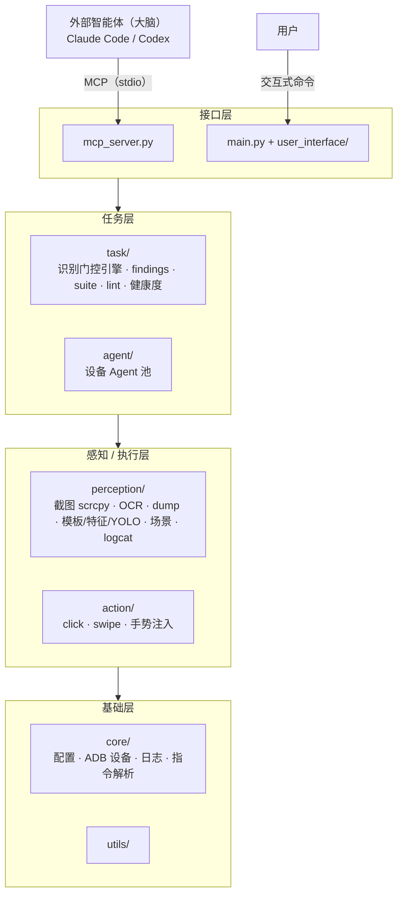

# 架构手册

AutoPlayQA 的定位：**确定性的眼睛（感知）和手脚（动作）+ 识别门控任务引擎**，本身不调用任何大模型；判断与编排交给外部智能体（Claude Code / Codex），经 MCP 或 CLI 驱动。本文档展开说明分层、依赖规则、感知回退链、识别通道、findings 取证链路与目录结构。

## 目录

- [四层分层](#四层分层)
- [依赖方向规则](#依赖方向规则)
- [零 LLM 原则](#零-llm-原则)
- [感知回退链](#感知回退链)
- [识别通道一览](#识别通道一览)
- [findings 取证链路](#findings-取证链路)
- [场景分类器：可插拔机制](#场景分类器可插拔机制)
- [目录结构说明](#目录结构说明)

## 四层分层



| 层 | 目录 | 职责 |
|------|------|------|
| 接口层 | `mcp_server.py`、`main.py` + `user_interface/` | 把下层能力暴露给外部智能体（MCP 工具）或人（CLI 命令），本身不含业务逻辑，只做参数校验、调用装配、结果格式化 |
| 任务层 | `task/`、`agent/` | 识别门控状态机引擎、findings 取证、套件连跑、lint/健康度、一设备一 Agent 的调度分发 |
| 感知/执行层 | `perception/`、`action/` | 截图/OCR/dump/模板/特征/YOLO/场景/logcat 等"眼睛"；click/drag/gesture 等"手脚" |
| 基础层 | `core/`、`utils/` | 配置加载、ADB 设备发现与连接、日志、LLM-free 指令解析、通用工具函数 |

`mcp_server.py`/`main.py` 双入口共用的对象图装配逻辑收在仓库根的 `bootstrap.py`（`load_app` 读配置建日志 + `build_runtime` 拼感知/任务对象图），避免两个入口各写一份装配代码而互相漂移。

## 依赖方向规则

依赖**只能自上而下**：接口层 → 任务层 → 感知/执行层 → 基础层。

- `perception/`、`action/` 不得 `import task` 下的任何模块；
- `core/`、`utils/` 不得 `import` 任何上层模块；
- 反向依赖或跨层依赖（比如感知层直接 import 任务层）是架构违规，即便测试能跑通也不允许。

## 零 LLM 原则

项目**自身不引入任何大模型调用**（不含 API key、不含模型 SDK）——智能永远在外部智能体那一侧，本项目只提供确定性的感知/动作/识别门控回放能力。这条原则同时体现在两处：

- **零 token 成本回放**：任务一旦写成识别门控状态机，后续回放不消耗任何模型调用，纯本地 OCR/dump/模板/特征/YOLO 识别 + adb 动作；
- **判断永远显式**：任何"需要智能判断"的步骤必须写成 `agent` 动作显式挂起交还给外部智能体，不允许在框架内部悄悄接入模型来"帮忙判断"。

## 感知回退链

真机环境（不同 ROM/机型）千奇百怪，以下三条回退链是真机踩坑换来的，任何改动都不许砍断顺序或跳过环节：

| 链路 | 顺序 | 触发条件 |
|------|------|----------|
| 截图 | scrcpy 帧流（默认）→ raw screencap 本地组装 → `screencap -p` | scrcpy 流失败自动回退；screencap 连续失败会整体切换（latch off）到下一级 |
| UI dump | `uiautomator dump /dev/tty` → 文件 dump | 部分 ROM 的 tty 直接输出为空，回退成"写文件再 `adb pull`" |
| 录屏证据 | 设备端 screenrecord 滚动分段录制 → history 截图帧兜底 | ROM 禁止录屏时，findings 的"飞行记录仪"证据退化成一组按时间排列的截图帧 |

默认截图后端 scrcpy 常驻 H.264 流本地解码，约 13ms/帧；不可用或需要绝对精确像素（如很紧的像素差分/`blank_screen` 阈值）时可在 `config.yaml` 里把 `capture.backend` 设为 `screencap`（一次 adb 往返 + 无损 RGBA，约 0.5s/帧）。findings 的证据截图始终走精确无损路径（`screenshot_exact`），不受 `capture.backend` 影响，避免 H.264 有损压缩干扰取证。

## 识别通道一览

任务节点的 `recognition.type`、`watchdogs[].type`、`popups[].recognition.type` 共用同一套识别通道：

| 通道 | 说明 | 适用场景 |
|------|------|----------|
| `always` | 恒命中，不做任何判断 | 只用来立即执行一个动作（如 `custom` 处理器）的节点 |
| `ui_text` | uiautomator dump 控件文本/desc 匹配 | 系统原生界面（设置、权限弹窗等），免费快 |
| `ocr` | 本地 OCR（rapidocr，懒加载） | 游戏单 Surface 渲染、dump 拿不到节点的场景；可加 `roi` 提速 |
| `template` | OpenCV 模板匹配（多尺度扫描 + alpha 掩膜 + 多实例 NMS） | 文字通道看不见的图形（图标/贴图），需先用 `capture_template` 采集 |
| `feature` | ORB 特征匹配，模板匹配的抗形变版本 | 纹理丰富、会小改版/缩放旋转/局部遮挡的锚点；纯色扁平图标提不出关键点，仍走 `template` |
| `yolo` | 训练好的 YOLO 目标检测（onnxruntime 推理，无 PyTorch 依赖） | 需要"定位+分类"、抗位移缩放遮挡的场景；模型由接入方训练放入 `task/models/`，无模型自动让位 |
| `scene` | 整屏场景分类，只回答"我在哪"，不产生点击坐标 | 交接轮次的定位（跑飞后确认位置）、异常分支断言；框架只内置 `blank` 标签，其余由接入方注册 |
| `blank_screen` | 灰度标准差低于阈值判定近黑/息屏/空帧 | watchdog 断言"不该白屏"、监控哨兵的卡死检测 |
| `and` / `or` | 组合多个子识别（`all_of`/`any_of`），共享同一帧 | 单一通道无法安全定位的锚点（如同一张图在多个界面复用，需再叠加一个文字条件） |

## findings 取证链路

**核心原则：异常 = 测试发现**，检测到就要留证上报，不是要静默绕过的噪音。

**三类触发**（不依赖任何 debug 开关，始终生效）：

1. 任务级 `watchdogs` 负向断言（禁止文字/白屏不该出现）——每步之后和识别超时时都会检查；
2. 节点级 `finding` 字段——弹窗/报错等异常分支节点进入即自我上报；
3. logcat `crash`/`ANR` 监控——轮询检测 `FATAL EXCEPTION`/`Fatal signal`/`ANR in`。

**触发即留证**：证据截图钉在"触发检测的那一帧"（`recognize(image=)`/`record(image=)` 复用同一帧，不是事后补抓的空屏），失败额外附 `ui_dump`。

**飞行记录仪（黑匣子）**：每条 finding 附带问题前约 60 秒的上下文——内联 `log_excerpt`（游戏 logcat 片段）+ `recent_flow`（流程时间线），证据文件包括 logcat 全片段、timeline JSON、`video`（设备端滚动分段录屏拉取的真实 MP4；ROM 禁录时回退 history 截图帧）。

**结果交付**：运行结果的 `findings` 字段任务成功也照列；`node_stats`（每节点命中来源统计：直接命中/超时恢复/弹窗协助/BACK 兜底/漂移）用来区分"任务锚点腐烂"与"游戏本身的 bug"；`report.json` 附一份自包含的 `report.html`（零外链单文件，截图内嵌 ``、录屏内嵌 `<video>`）方便不看 JSON 的 QA 同事直接打开。

**保留 / 导出 / 推送**：

- 保留：启动时按 `findings.retention_days`（默认 14 天，`<=0` 关闭）清理过期日期目录，`outputs/findings/<日期>/<设备>/<run_id>/` 每个目录自包含可浏览；
- 导出：`findings.export_dir` 配置后，有 finding 的运行自动打成单个 zip（`<时间戳>_<任务>_<设备>_<状态>.zip`），或调用方按次通过 `run_task(export_to=...)` 指定；
- 推送：`findings.notifiers`（飞书自定义机器人 / 通用 webhook）在 run 收尾推一条中文汇总，`min_findings`/`on_status` 过滤，推送失败只记日志不影响运行结果。

**空窗期哨兵（sentinel）**：`agent` 交接期间引擎的 run 已经封口，屏幕和 logcat 本来无人看管——`start_monitor` 挂的后台帧监控可以额外附一个哨兵，白吃已有帧继续查白屏卡死与 crash/ANR，命中就写成一次独立的 findings run（任务名 `monitor_sentinel`）。

## 场景分类器：可插拔机制

`classify_scene`（MCP）/ `{"type": "scene"}` 识别节点回答的是"当前是哪个功能界面"，不产生点击坐标。框架内置的标签只有一个：`blank`（近黑/息屏/空帧），外加非场景信号 `other_app`（前台包名不是被测应用）和永不猜测的 `unknown`。

其余标签（如 `popup`、`popup.error`、`menu.settings`）由接入方通过 `perception.scene_classifier.register_scene_probe(label, fn, *, description=..., order=...)` 注册自己的探针函数；相应地也有 `unregister_scene_probe`/`clear_scene_probes`/`registered_scene_probes` 管理已注册的探针。节点/watchdog 对场景标签的匹配是**点号前缀匹配**：`"popup"` 会命中 `"popup.error"`，`"menu"` 会命中 `"menu.settings"`。`classify_scene` 的返回值里带一个 `taxonomy` 字段，汇总当前生效的完整标签体系（内置 + 已注册），供智能体在不了解这个项目具体分了哪些场景标签的情况下，也能读到当下"能认出哪些界面"。

## 目录结构说明

```
autoplayqa/
├── mcp_server.py          # MCP 入口（FastMCP/stdio），装配复用 bootstrap.py
├── main.py                # CLI 入口，装配复用 bootstrap.py
├── bootstrap.py           # 双入口共用装配层：load_app + build_runtime
├── .mcp.json.example      # Claude Code 自动发现配置模板
├── config.yaml.example    # 配置模板（缺省走默认值）
├── requirements.txt       # 依赖
│
├── core/                  # 基础设施：配置/设备管理/日志/指令解析/adb 超时/通知推送
├── agent/                 # 一设备一 Agent，AgentPool 管理多设备选择与分发
├── action/                # 动作执行：路由（click/drag/input_text/wait/key/gesture）+ 动作/任务 JSON schema
├── perception/             # 感知：截图（scrcpy/screencap）、OCR、dump、模板/特征/YOLO、场景分类、录屏、logcat
├── task/                  # 识别门控任务引擎（核心）：状态机/套件/加载校验/识别器/findings/lint/健康度/回放缓存
│   ├── custom_actions/    #   进程内确定性动作，目录下新建 <模块>.py 即自动发现注册
│   ├── task_definitions/  #   任务 JSON（含 common/ 共享节点、suites/ 套件）——接入方资产，默认不入库
│   ├── templates/         #   模板匹配图库——接入方采集，默认不入库
│   └── models/            #   YOLO 模型库——接入方提供，默认不入库
├── record/                # getevent 手势录制：流解析、录制会话状态、可选帧流
├── injector/               # 无 root 多指注入 dex helper（可审源码，dex 产物不入库）
├── user_interface/        # 本地 CLI：命令分发（cli_handler.py）与解析（command_parser.py）
├── utils/                 # 调试落盘、图片标注、像素差分等通用工具
│
├── vendor/                # 第三方二进制（scrcpy-server，版本须与代码常量一致）
├── tests/                 # 单元测试（subprocess 全部 mock，不依赖真机）
├── outputs/                # 运行时产物：截图/日志/debug/findings（自包含证据夹）/recordings，不入库
│
├── training/               # YOLO 训练流水线（离线工具线，运行时代码不得 import）
└── docs/                   # 使用手册与图示
```

**通用 vs 专属**：框架侧是与游戏无关的通用能力（感知通道/动作后端/任务引擎/findings 取证/MCP 与 CLI 接口）；游戏专属的部分由接入方提供——`task/task_definitions/` 的任务与套件、`task/templates/` 的模板图、`task/models/` 的 YOLO 模型、以及 `register_scene_probe` 注册的场景标签，全都是本机/接入项目资产，默认不入库。
