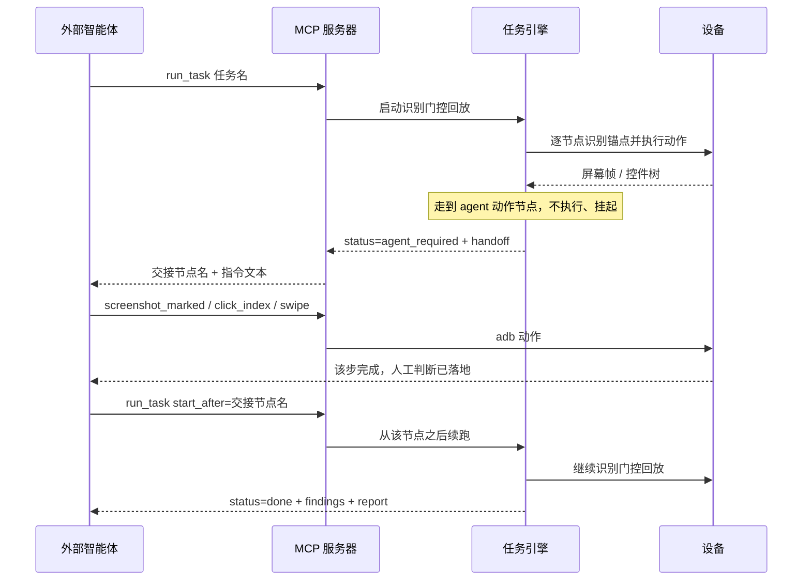

# MCP 接入手册

AutoPlayQA 的定位是"确定性的眼睛和手脚"，判断与编排交给外部智能体（Claude Code / Codex）。MCP（Model Context Protocol）是把这些能力暴露给智能体的推荐方式：`mcp_server.py` 用 FastMCP 通过 stdio 启动一个服务器，注册了设备/感知/动作/录制/监控/任务共 40 余个工具。

## 目录

- [接入 Claude Code](#接入-claude-code)
- [接入 Codex](#接入-codex)
- [工具全集](#工具全集)
- [agent 交接：识别到人类判断步骤怎么办](#agent-交接识别到人类判断步骤怎么办)
- [后台任务：长流程怎么跑](#后台任务长流程怎么跑)
- [注意事项](#注意事项)

## 接入 Claude Code

复制模板文件并把 `command` 改成本机 Python 解释器的绝对路径：

```powershell
copy .mcp.json.example .mcp.json
```

`.mcp.json` 内容示例（`command`/`env.PATH` 改成本机实际路径）：

```json
{
  "mcpServers": {
    "autoplayqa": {
      "command": "C:\\path\\to\\python.exe",
      "args": ["mcp_server.py"],
      "env": {
        "PATH": "C:\\path\\to\\Android\\Sdk\\platform-tools;${PATH}"
      }
    }
  }
}
```

之后在本项目目录启动 Claude Code，会自动发现名为 `autoplayqa` 的 MCP 服务器，无需额外命令。

## 接入 Codex

Codex CLI 在 `~/.codex/config.toml` 里添加一段（路径同样按本机实际情况改）：

```toml
[mcp_servers.autoplayqa]
command = "C:\\path\\to\\python.exe"
args = ["C:\\path\\to\\autoplayqa\\mcp_server.py"]
```

## 工具全集

以下按功能分类列出全部 MCP 工具（名字与参数以 `mcp_server.py` 源码为准）。所有工具入参用 `device_id`（字符串，设备序列号/地址）标识目标设备，除非特别说明。

### 设备管理

| 工具 | 关键参数 | 说明 |
|------|----------|------|
| `list_devices` | 无 | 列出已连接的 Android 设备/模拟器（adb） |
| `connect_device` | `address` | 通过 Wi-Fi 连接设备（`adb connect`），`address` 为 `ip` 或 `ip:port`（默认端口 5555） |
| `disconnect_device` | `address`（可选） | 断开一个无线 adb 设备；不传则断开全部无线设备 |
| `enable_wireless` | `device_id`、`port`（默认 5555） | 把 USB 连接的设备切到 TCP/IP 模式（`adb tcpip`），返回地址供 `connect_device` 使用；设备重启后失效 |
| `pair_device` | `address`、`code` | 与 Android 11+ 无线调试设备配对（`adb pair`），每台机器只需配对一次；配对端口与连接端口不同 |

### 感知（免费定位通道）

| 工具 | 关键参数 | 说明 |
|------|----------|------|
| `screenshot` | `device_id`、`full_resolution` | 截图存为 PNG 并返回路径；默认短边归一化到 720px 省 token，`full_resolution=true` 拿原图（识别与坐标始终用设备原始像素） |
| `ui_dump` | `device_id` | uiautomator 控件树，返回可见节点的 text/desc/center/bounds；免费快，但游戏单 Surface 渲染时节点很少甚至没有 |
| `find_text` | `device_id`、`text` | 定位屏幕文字并返回点击坐标；先走 uiautomator dump，未命中再走本地 OCR |
| `ocr` | `device_id`、`roi`（可选） | 对屏幕（或指定 ROI）跑本地 OCR，返回 `[{text, score, bbox, center}]` |
| `screenshot_marked` | `device_id`、`source`（`auto`/`dump`/`ocr`/`both`）、`full_resolution` | Set-of-Marks 标注图：截图叠加序号徽标（红=可点控件 蓝=纯文本），返回元素表，配合 `click_index` 按号点击免猜坐标 |
| `find_template` | `device_id`、`template`、`threshold`、`roi`、`multi`、`scales` | OpenCV 模板匹配定位图标/贴图（文字通道看不见的纯图形），`multi=true` 返回全部实例 |
| `list_templates` | 无 | 列出已保存模板名（`task/templates/` 下的文件名主干） |
| `capture_template` | `device_id`、`name`、`region` | 裁剪当前屏幕一块区域另存为模板，闭环 采集→匹配 流程 |
| `detect_objects` | `device_id`、`classes`、`conf`、`roi`、`model` | 用训练好的 YOLO 模型定位+分类画面物件，抗位移/缩放/遮挡；无模型时返回 `found=False` |
| `list_yolo_classes` | `model`（可选） | 列出 YOLO 模型的类别名（id→name），附版本信息（若 `models.json` 有记录） |
| `classify_scene` | `device_id` | 整屏场景判定（"我现在在哪个界面"），返回 `scene`/`confidence`/`evidence`/`taxonomy`；标签体系由接入方注册，框架只内置 `blank` |

### 动作

| 工具 | 关键参数 | 说明 |
|------|----------|------|
| `click` | `device_id`、`x`、`y` | 在绝对像素坐标点击 |
| `click_index` | `device_id`、`index` | 点击上一次 `screenshot_marked` 标注图里第 N 号元素；每台设备服务端缓存最近一次的元素表 |
| `swipe` | `device_id`、`x1,y1,x2,y2`、`duration_ms`（默认 500） | 滑动/拖拽 |
| `input_text` | `device_id`、`text` | 向当前焦点输入框输入文本（仅 ASCII，走 adb） |
| `press_key` | `device_id`、`keycode` | 按 Android keycode（常用：3=Home，4=Back，82=Menu，224=Wake，26=Power） |

### 录制

| 工具 | 关键参数 | 说明 |
|------|----------|------|
| `record_actions_start` | `device_id`、`kind`（`explore`/`handoff`）、`task`、`node`、`run_id`、`label` | 开始记录**智能体自己**驱动设备的动作（自录）：每次 click/click_index/swipe/input_text/press_key 连同动作前一帧截图一起追加进会话日志，用于把探路过程转成任务草稿 |
| `record_actions_stop` | `device_id` | 停止自录并返回完整步骤序列（每步含动作 JSON、命中的标注元素、截图文件名） |
| `calibrate_touch` | `device_id`、`force` | 探测（或复用缓存的）触摸面板→显示像素标定，供手势录制使用 |
| `record_gestures_start` | `device_id` | 开始记录**用户手指**的真实手势（`getevent` 流），按 tap/长按/滑动/多指分段 |
| `record_gestures_stop` | `device_id` | 停止手势录制，返回手势序列（类型/参数/前后帧/锚点裁剪图），产物落 `outputs/recordings/<时间戳>/` |

### 后台帧监控

| 工具 | 关键参数 | 说明 |
|------|----------|------|
| `start_monitor` | `device_id`、`interval_ms`（默认 1000）、`max_frames`（默认 200）、`full_resolution`、`sentinel`（默认 true） | 后台按固定间隔持续截图落盘，供长流程/观察用户操作时按游标增量拉取；`sentinel=true` 额外挂一个空窗期哨兵（见下） |
| `get_new_frames` | `device_id`（可省，仅一台设备时自动解析） | 拉取自上次调用以来新产生的帧路径；`sentinel` 字段返回哨兵累计统计 |
| `stop_monitor` | `device_id` | 停止后台监控并返回汇总；已停止的监控幂等返回同一份汇总；若挂了哨兵，此时封口其 findings run 并返回报告路径 |

### 任务（识别门控回放）

| 工具 | 关键参数 | 说明 |
|------|----------|------|
| `get_task_schema` | 无 | 返回任务 JSON 格式完整参考文档（写任务前先读这个） |
| `list_tasks` | 无 | 列出 `task/task_definitions/` 下已保存的任务名 |
| `get_task` | `name` | 加载任务（含 `includes` 合并），附带 `_steps`（节点→步号）与 `_step_outline`（流程大纲） |
| `save_task` | `name`、`task_json`（字符串） | 校验并保存任务 JSON；返回 `lint_warnings`（最佳实践提醒），`config lint.strict=true` 时有警告会拒绝保存 |
| `validate_task` | `task_json` | 干跑校验一个任务 JSON（不写盘），返回同 `save_task` 的校验结果 |
| `list_custom_actions` | 无 | 列出已注册的 `custom` 动作名（`task/custom_actions/` 自动发现，不要凭记忆硬编码） |
| `lint_saved_task` | `name` | 对一个已保存任务跑 lint（W 规则警告，不写盘） |
| `get_step_labels` | `name` | 只返回节点→步号映射，比 `get_task` 更轻量 |
| `list_includes` | 无 | 列出 `task_definitions/` 下可被 `includes` 引用的共享节点片段 |
| `run_task` | `device_id`、`name`、`start_after`、`export_to` | 同步阻塞运行一个已保存任务，跑完才返回；结果带 `findings`/`report`/`node_stats` |
| `start_task` | `device_id`、`name`、`start_after`、`export_to` | 后台运行任务，立即返回 `run_id`；配合 `get_run_status` 轮询进度 |
| `list_suites` | 无 | 列出 `task/task_definitions/suites/` 下的套件名 |
| `run_suite` | `name`、`device_id`、`export_to` | 后台运行整个套件（登录一次连跑多用例）；同样用 `get_run_status` 轮询，含用例级进度 |
| `get_run_status` | `run_id` | 轮询 `start_task`/`run_suite` 启动的后台运行；纯内存读取，可高频轮询不阻塞 |
| `clear_replay_cache` | 无 | 清空回放锚点缓存（OCR ROI 加速用），UI 大改后用以避免一波误报的 `anchor_drift` |

## agent 交接：识别到人类判断步骤怎么办

任务里的 `agent` 动作（`llm` 为兼容别名）代表"这一步需要智能判断，引擎自己做不了"。引擎识别到该节点后**不会执行动作**，而是挂起并返回一份交接指令，等智能体做完那一步再从该节点之后续跑：



挂起时的返回结构：

```json
{
  "status": "agent_required",
  "handoff": {"node": "<节点名>", "instruction": "<给智能体的指令文本>"}
}
```

智能体收到后，用 `click`/`swipe`/`input_text` 等动作工具手动完成这一步，然后调用：

```
run_task(device_id, name, start_after="<handoff.node>")
```

或后台版本 `start_task(device_id, name, start_after="<handoff.node>")` 续跑。

## 后台任务：长流程怎么跑

`run_task`/`run_suite` 若同步阻塞，长流程/全流程冒烟体验差（中途没有任何进度反馈）。改用：

1. `start_task(device_id, name)` 或 `run_suite(name, device_id)` 立即拿到 `run_id`，状态为 `running`；
2. 轮询 `get_run_status(run_id)`：返回 `status`（`running`/`agent_required`/`done`/`error`）、`current_node`、`steps`、`elapsed_s`；`running` 时还带 `recent_events`（引擎最近的流程事件，能区分"慢但在推进"和"卡住了"）；套件运行额外带 `case`/`case_index`/`cases_total`/`cases_done`；
3. 到达终态后 `result` 字段带上与 `run_task` 同构的完整结果（`steps`/`findings`/`report`/`handoff`）；
4. 若终态是 `agent_required`，按 `result["handoff"]` 完成该步后 `start_task(start_after=<节点>)` 续跑。

**引擎是单例**：同一时刻只允许一个后台 run 处于 `running` 状态；重复 `start_task`/`run_suite` 会返回 `{ok: False, error}` 报出当前占用的 `run_id`。

## 注意事项

- MCP 服务器把每次工具调用记一条 `EVT mcp_tool` 日志，工具本身的异常不会被吞掉，会原样通过 MCP 返回给客户端。
- `screenshot`/`screenshot_marked` 返回的图默认短边归一化到 720px 省 image token；坐标空间（`click` 等动作工具期望的坐标）**始终是设备原始像素**，不受这个缩放影响。
- `screenshot_marked` 比普通 `screenshot` 慢（跑了一次 dump 和/或 OCR），适合用在交接轮次而不是紧循环里。
- `start_monitor` 挂的哨兵（sentinel）专门覆盖 `agent` 交接期间"引擎那一轮 run 已经封口、没人看屏幕"的空窗，靠白吃已有帧检测白屏/崩溃，命中会写成一条独立的 findings run（任务名 `monitor_sentinel`），不占用额外截图开销。
