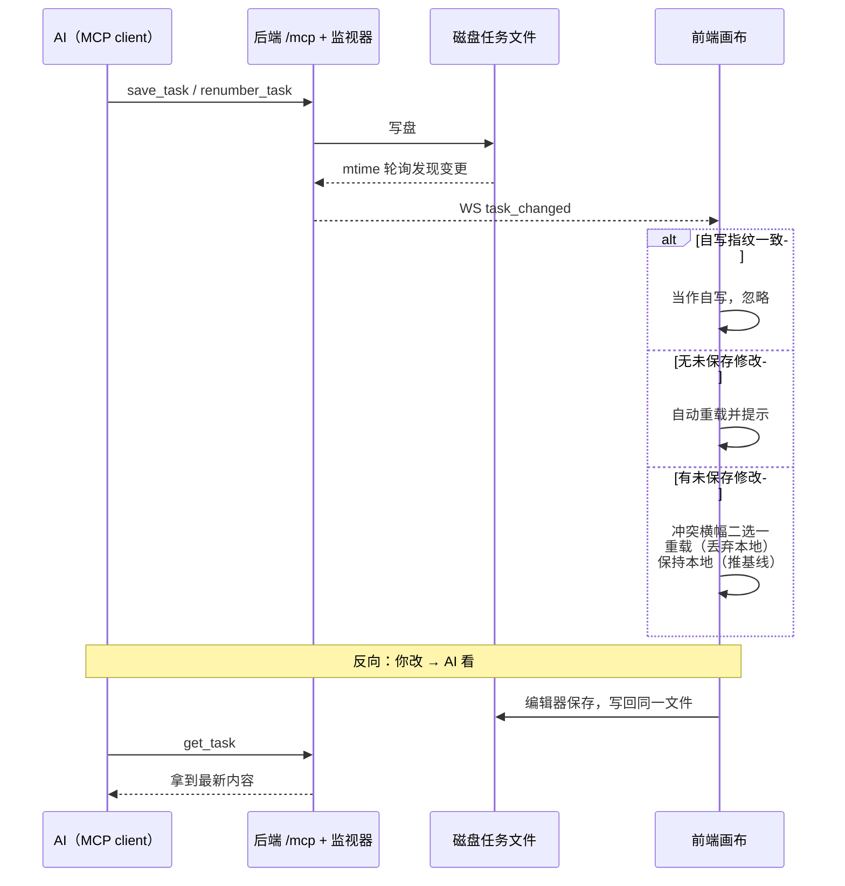

# AI / MCP 协同编辑

这边写、那边同步看：AI 经内嵌 MCP 改任务时与编辑器同进程，画布实时跟着变。
同一页还说明了运行层面必须遵守的互斥约束。

**前置条件**：✅ 编辑器后端在跑（AI 连 `http://127.0.0.1:8930/mcp`）

后端在 `/mcp` 内嵌了一个只做编辑面的 MCP server，AI 经它改任务时与编辑器**同进程**，
所以两边是实时联动的：

- **AI 改 → 画布看**：AI 调 `save_task` / `renumber_task` 落盘后，后端文件监视器立刻
  推 `task_changed` 给前端：
  - 画布**没有**未保存修改 → 自动重载并提示「任务已被外部修改（AI/MCP），画布已自动重载」；
  - 画布**有**未保存修改 → 顶部弹黄色冲突横幅，两个按钮二选一：
    **重载（丢弃本地修改）** 或 **保持本地（下次保存将覆盖外部修改）**。
    选「保持本地」后基线会推到磁盘当前版本，你下次保存是有意覆盖，不会被 409 卡住。
  - 编辑器分得清「AI 写的」和「自己刚保存的」：自己保存后会记下写盘内容指纹，
    窗口内收到事件先比对磁盘内容，一致才当自写忽略——拿不到磁盘内容宁可当外部写入提示你，
    绝不静默吞掉 AI 的改动。
- **你改 → AI 看**：编辑器保存即写回同一个任务文件，AI 下次 `get_task` 拿到的就是最新内容。
- 套件页有同样的机制（`suite_changed`）；文件被外部删除时只提示，本地内容保留，保存可重建。
- Claude Code 接入方式与工具清单见本页[内嵌 MCP](#内嵌-mcp)一节。



*同进程 + mtime 轮询 + WS `task_changed` 三段接力；三条分支互斥，自写指纹先判、拿不到磁盘内容宁可当外部写入提示。*

## 内嵌 MCP

后端在 `/mcp` 内嵌了一个 **streamable HTTP MCP server**（`backend/mcp_embed.py`，
仅编辑面：get_task / validate_task / save_task / renumber_task / lint /
includes / custom-actions / suites）。AI 经它编辑任务时与编辑器同进程，
文件监视器（`backend/events.py`，mtime 轮询 + `/ws/events` WebSocket）把
`task_changed` 实时推给前端：

- 画布无未保存修改 → **自动重载**并提示"任务已被外部修改（AI/MCP）"；
- 有未保存修改 → 冲突横幅，人选择"重载丢弃本地"或"保持本地"。

Claude Code 接入：**仓库的 `.mcp.json.example` 已经带了这条示例条目**，照常
`copy .mcp.json.example .mcp.json` 即可，不用手写：

```json
"pipeline-editor": { "type": "http", "url": "http://127.0.0.1:8930/mcp" }
```

这个地址就是后端 `main.py` 的默认端口（8930）加 `app.py` 里 `app.mount("/mcp", ...)`
的挂载路径；改了 `--port` 记得同步改 URL。条目在编辑器**没起**时连不上是正常的：
agent 会自动退回 AutoPlayQA stdio MCP（`.mcp.json` 里名为 `autoplayqa`）上的同名
编辑工具（功能一致，只是用户看不到实时画面）。设备/感知/运行类工具只在 `autoplayqa` 上。

## 与 MCP 的互斥

编辑器后端与 AutoPlayQA 的 mcp_server 是两个进程、两套引擎实例，互不知晓
对方的后台 run。**编辑器运行任务/套件期间，不要同时用 MCP 的
start_task / run_suite 打同一台设备**（输入互踩、findings 目录交错、
replay_cache 并发写）。纯编辑（校验/保存）随时安全。
