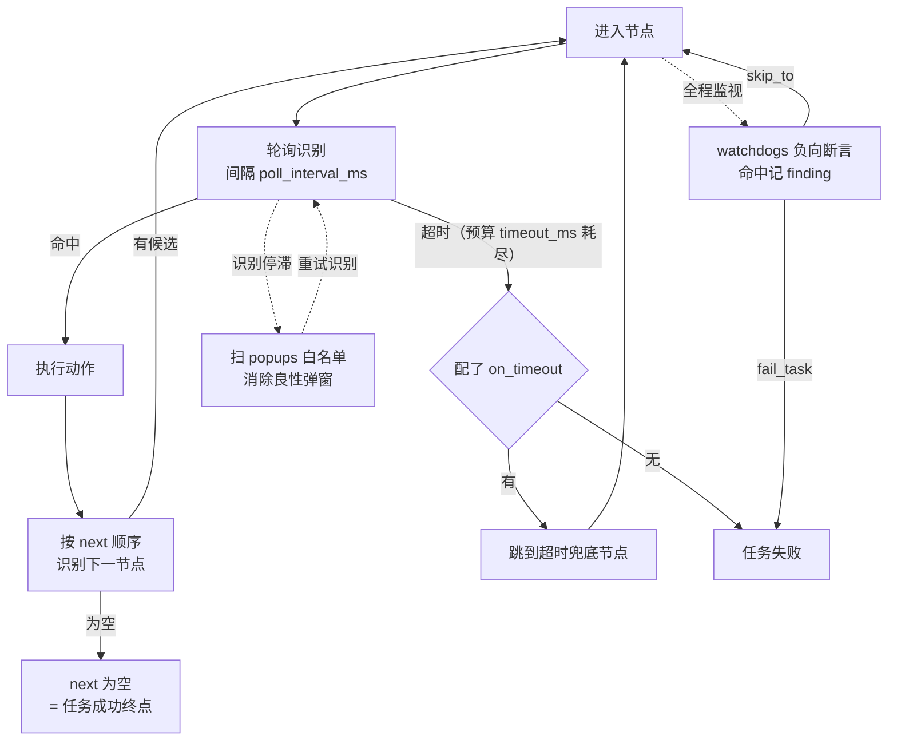

# 核心概念

后文反复出现的术语，先在这里对齐（首次出现处不再解释）：

| 术语 | 含义 |
| --- | --- |
| **任务** | 一个 `task/task_definitions/<任务名>.json`，描述在一台设备上跑的状态机；编辑器直接编辑它，不另存副本 |
| **节点** | 状态机的一步 = 一次**识别** + 一个**动作**；画布上的一张卡片 |
| **next** | 节点的后继候选**数组**，顺序 = 识别优先级；为空 = 任务成功终点 |
| **include 节点** | 由任务的 `includes` 引进的共享片段节点（来自 `_merge.include_map`），编辑器里只读，保存时剔除，绝不固化进主文件 |
| **套件** | `suites/` 下的用例编排：按顺序跑多个任务，带续跑节点、用例入口与失败策略 |
| **defaults** | 任务级时序默认值；优先级 节点字段 > `defaults` > 引擎默认，编辑器不把它展开到节点上 |
| **sidecar 布局** | 节点坐标单独存 `task/task_definitions/.layout/<任务名>.json`，不进任务 JSON |
| **finding** | 一条 QA 发现（severity + message），由节点的 `finding` 开关或 watchdog 产生，运行结束汇总、报告页可查 |
| **watchdog** | 任务级**负向断言**：命中即记 finding，可 `fail_task` 中止或 `skip_to` 跳转继续测 |
| **popup** | 良性弹窗白名单：仅在识别停滞时扫描，被消除的不记 finding |

## 一个节点怎么走

*节点 = 一次识别 + 一个动作：命中就动作、再按 `next` 优先级找下一个；轮询超时有 `on_timeout` 走兜底、没有就失败。popups 与 watchdogs 是旁路，不占主干。*
