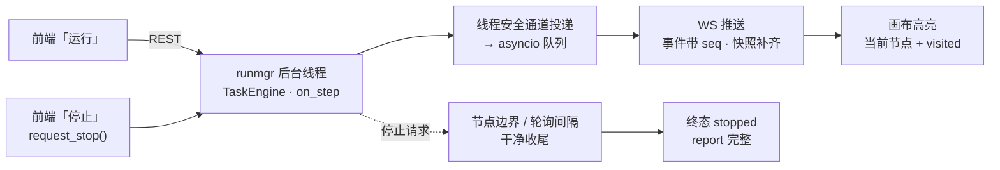

# 运行与调试

选一台在线设备把任务真跑起来，画布会实时高亮走到哪一步；停止走引擎的协作式干净收尾。

**前置条件**：✅ 后端已启动　✅ 有在线设备并在下拉里选中（没选设备时「运行」按钮是禁用的）

右侧「运行」Tab：

1. 选设备（下拉旁的刷新按钮重新发现设备）。
2. 可选填 `start_after`——从该节点**之后**续跑，跳过前面的开机链。
3. 点「运行」。运行期间：
   - 画布上**当前节点绿色呼吸高亮**，走过的节点浅绿底（visited 轨迹），
     刚走过的那条边会动起来；
   - 打开「跟随」开关，视口会随当前节点平滑居中；
   - 面板显示状态 / 当前节点 / 步数 / 错误，套件另有用例进度条；
   - 事件时间线列出每一步，点节点事件可定位到画布；
   - 断线时出现「重连中…」标签，重连后按事件序号去重 + 快照补齐，不会重复计数或漏步。
   - 运行期间工具条挂上「运行中（画布只读）」，编辑类按钮整排禁用。

4. **停止**：点「停止」走引擎的协作式停止——在下一个节点边界或轮询间隔内干净收尾，
   **report 与证据链完整**，终态为 `stopped`。套件停止时当前用例干净收尾，
   套件级汇总不生成（会有一条提示说明）。
5. 结束后弹通知汇总步数与 findings 条数；`findings` 列表按 severity 着色显示在面板里。
   状态为 `agent_required`（任务挂起等待 agent 交接）时会展示交接指令，
   外部完成交接后用 `start_after` 从交接节点续跑。

> [!WARNING]
> 编辑器后端和 AutoPlayQA 的 mcp_server 是两个进程，互不知晓对方的 run：
> 编辑器跑任务/套件期间不要用 MCP 的 `start_task` / `run_suite` 打同一台设备
> （详见 [AI / MCP 协同编辑 · 与 MCP 的互斥](/editor/ai-mcp#与-mcp-的互斥)）。

*运行事件单向流动：引擎线程 → 线程安全通道 → asyncio 队列 → WS → 画布；停止是协作式的，不打断收尾。*

## 停止运行

编辑器的"停止"走框架 `TaskEngine.request_stop()` 的协作式停止：
在下一个节点边界或轮询间隔内经 `_finish` 干净收尾——**report
与证据链完整**，run 以 `stopped` 终态返回完整 result。套件停止时当前
case 干净收尾，套件级汇总不生成（避免 on_case_failure 把停掉的 case
当失败去冷启动重试）。
