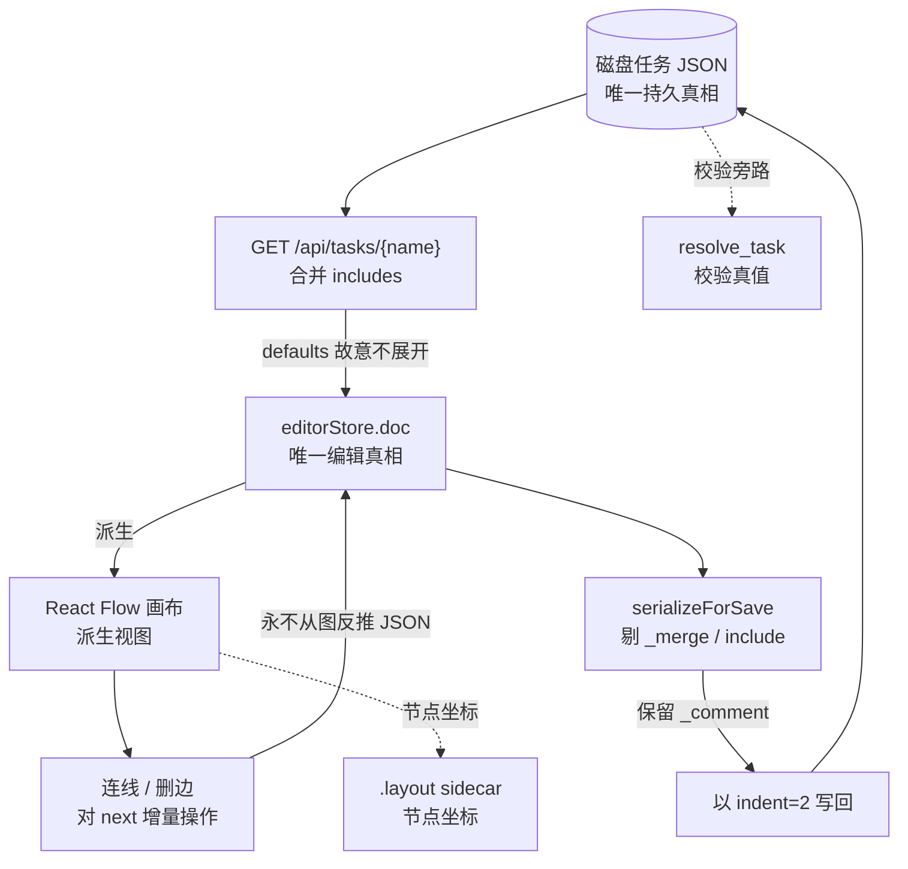

# 架构与数据流

给贡献者的背景：两端各自的技术栈，以及必须守住的数据流硬约束。

```text
frontend/  React 19 + TS + React Flow 12 + antd 5 + zustand(+zundo undo/redo)
backend/   FastAPI（直接 import AutoPlayQA 模块；校验真值 = task_loader.resolve_task）
```

- **单一数据源**：任务 JSON 的内存镜像（`editorStore.doc`）；画布是派生视图，
  连线/删边是对 `next` 数组的增量操作，永不从图反推 JSON。
- **include 节点只读**（灰色虚框 + 锁图标）：来自 `_merge.include_map`，
  保存时剔除，绝不固化进主文件。
- **defaults 不展开**：后端给编辑器的合并态特意不做 `_apply_defaults`，
  round-trip 语义无损——JSON 深度相等，由 `tests/test_task_roundtrip.py` 对本机
  任务目录里的每个任务逐个回归（保存链路统一以 `indent=2` 重写文件，
  格式可能与手写原文不同）。
- **布局 sidecar**：节点坐标存 `task/task_definitions/.layout/<name>.json`，
  不污染任务 JSON 与 git diff。
- **运行**：后台线程跑引擎，on_step 回调经 WebSocket 推送（事件带 seq，
  断线快照补齐），画布高亮当前节点 + visited 轨迹。



*数据流是单向闭环：磁盘 → 展示态 → `doc` → 画布，保存时 `serializeForSave` 剔掉 `_merge` / `_steps` / `_step_outline` 与 include 来源节点后原路写回；布局 sidecar 与 `task_loader.resolve_task` 校验各走旁路，与展示态是两条路径。*
